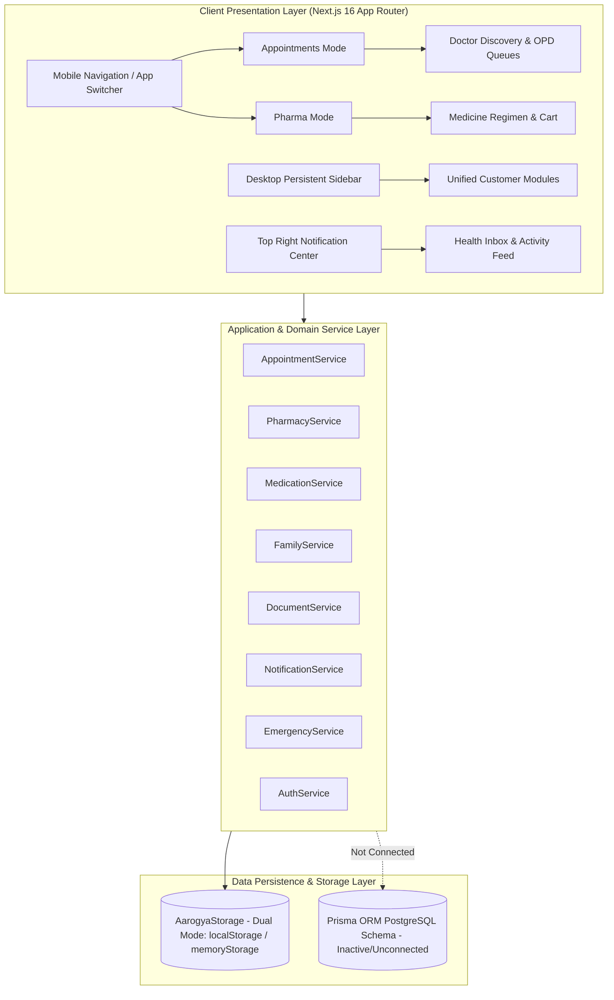
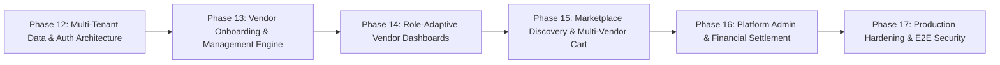

# PHASE 11 — COMPLETE PRODUCT AUDIT & MARKETPLACE READINESS AUDIT

**Document Title**: Comprehensive Product & Multi-Vendor Marketplace Readiness Audit  
**Platform**: Quick Aarogya (Multi-Vendor Healthcare Marketplace + Personal & Family Health Management Platform)  
**Date**: 2026-08-27  
**Audit Scope**: Codebase Architecture, Database Schema, Authentication & Authorization, Multi-Tenant Domain Models, Security & Data Isolation, Mobile & Desktop UX, AI Safety, Payment Systems, Technical Debt, and Phased Transition Roadmap.

---

## A. Current Architecture

### 1. Architectural Summary
- **Framework & Runtime**: Next.js 16 (App Router), React 19, TypeScript 5, TailwindCSS 4, Lucide React, Zustand state stores, and Vitest test runner.
- **Current Paradigms**:
  - Dual-app mode customer experience (Appointments App vs Pharma App) driven by `useAppModeStore` and `AppModeFloatingSwitch`.
  - Synchronous in-memory/localStorage data abstraction via `AarogyaStorage` with custom storage event synchronization (`storage-update`).
  - Next.js REST API routes located in `src/app/api/v1/` acting as thin proxies to domain service classes.
- **Architectural Assessment**:
  - The application is currently **100% customer-centric**.
  - All data is client-side persisted via `AarogyaStorage` seeded from `mockData.ts`.
  - While a Prisma schema (`prisma/schema.prisma`) exists, it is **completely disconnected** from frontend runtime execution and services.
  - There is currently **zero vendor dashboard architecture**, **zero staff authorization**, **zero multi-vendor transaction splitting**, and **zero platform administrator portal**.

---

## B. Feature Completion Matrix

| Feature Area | Module | Current Status | Description & Assessment |
| :--- | :--- | :--- | :--- |
| **CUSTOMER** | Authentication & MFA | `PARTIAL` | Login, Registration, OTP mock, Role selection in `auth.service.ts`. Missing real JWT session validation, OAuth2/OIDC, and server cookie guards. |
| | Onboarding & ABHA Setup | `COMPLETE` | Multi-step personal onboarding, ABHA ID linking, and chronic disease profiling in `/onboarding`. |
| | Dual Home Cockpit | `COMPLETE` | Adaptive home rendering for Appointments mode (specialists, live OPD token, ER directory) and Pharma mode (pill schedule, dose logger, refill alert, express catalog) in `/page.tsx`. |
| | Doctor Discovery & Booking | `COMPLETE` | Specialist search, hospital filtering, slot picker, OPD queue tracking, and booking cancellation in `/doctors` & `/appointments`. |
| | Hospital & ER Directory | `COMPLETE` | Hospital directory, ICU bed availability indicators, emergency 24/7 helplines in `/hospitals`. |
| | Pharmacy Catalog & Shop | `COMPLETE` | Medicine search, chronic categories, stock levels, prescription requirements in `/pharmacies`. |
| | Medicine Cart & Checkout | `COMPLETE` | Dedicated cart in `/cart` with quantity adjustments, auto-attached prescription verification, 45-min express delivery, and order placement. |
| | Medication Regimen & Pills | `COMPLETE` | Daily dose loggers, adherence streak tracking, stock counters, and refill threshold alerts in `/medicines`. |
| | Medical Document Vault | `COMPLETE` | Document upload, categorization, biomarker extraction tables, encrypted download simulation in `/records`. |
| | Diagnostic Lab Booking | `COMPLETE` | Home sample collection booking, phlebotomist tracking, and lab package catalog in `/labs`. |
| | Family Health & Proxies | `COMPLETE` | 8 Granular permissions, caregiver least-privilege defaults, care context switcher, cross-member live feed in `/family`. |
| | Health Inbox & Notifications | `COMPLETE` | Unified activity center, 7 category tabs, deterministic priority rules (Urgent/Important/Normal), multi-channel delivery audit logs in `/inbox`. |
| | Emergency ICE & QR Profile | `COMPLETE` | Life-saving triage data, blood group, PIN protection, emergency contact dispatch in `/emergency`. |
| | Healthcare Expenses (80D) | `COMPLETE` | Out-of-pocket ledger, Tax 80D receipt breakdown, insurance claim tracker in `/expenses`. |
| | Patient Profile & ABHA | `COMPLETE` | Personal vitals, BMI calculator, ABHA card display in `/profile`. |
| | Privacy & Security Consents | `COMPLETE` | Consent manager, biometric toggle simulation, audit trail viewer in `/settings`. |
| **VENDOR** | Vendor Registration & KYC | `MISSING` | No onboarding or verification flow for independent doctors, hospital networks, pharmacies, or diagnostic labs. |
| | Vendor Role-Specific Dashboards | `MISSING` | No dashboard layouts for Doctor (slots, queue, earnings), Pharmacy (inventory, order fulfillment), Hospital (wards, doctors, OPD), or Diagnostic Lab (sample collection, report upload). |
| | Organization & Branch Topology | `MISSING` | Vendors cannot create branches, multiple clinic locations, or service zones. |
| | Vendor Staff & RBAC | `MISSING` | Healthcare organizations cannot add staff members (receptionists, pharmacists, phlebotomists, lab technicians) with scoped permissions. |
| | Service & Product Management | `MISSING` | Vendors cannot publish, update, price, or control availability for their services, consultation fees, or medicine inventories. |
| | Vendor Orders & Fulfillments | `MOCKED` | Single-pharmacy mock orders in `AarogyaStorage`; no vendor-specific order management interface exists. |
| | Vendor Payouts & Commissions | `MISSING` | No vendor ledger, platform commission deduction rules, bank settlement, or payout tracking. |
| | Verified Provider Badging | `MOCKED` | Hardcoded `isVerified: true` flags in `mockData.ts`; no verification lifecycle or document review pipeline. |
| **ADMIN** | Vendor Onboarding & Audit | `MISSING` | No platform admin view to review medical licenses, drug licenses, or clinical accreditations. |
| | Marketplace Taxonomy & Catalog | `MISSING` | No interface to manage healthcare service categories, master drug database, or diagnostic test parameters. |
| | Financial Settlements & Escrow | `MISSING` | No platform-wide commission rules, payout release mechanisms, or refund moderation tools. |
| | Dispute & Review Moderation | `MISSING` | No clinical review moderation or vendor dispute handling interface. |
| | Platform Audit Logs & Security | `PARTIAL` | Mock audit log records in `storage.ts`; no admin-level viewer or centralized query API. |

---

## C. Marketplace Readiness

### Readiness Evaluation: Low to Moderate (Architectural Refactoring Required)
1. **Catalog vs Marketplace**:
   - Currently, doctors, hospitals, pharmacies, and lab tests act as static, platform-seeded directories.
   - Independent healthcare businesses cannot register, claim, list, manage stock, or set custom consultation rates.
2. **Order & Booking Ownership**:
   - When a user books an appointment or places a pharmacy order, the record is stored globally in the user's local profile state. There is no vendor tenant record receiving and acknowledging the order in real time.
3. **Reputation & Review Integrity**:
   - Ratings and reviews are static mock properties on entities (e.g. `ratingAverage: 4.9`). There is no mechanism for patients to submit verified post-consultation reviews or for vendors to respond publicly.
4. **Marketplace Discovery & Filtering**:
   - Basic search exists across doctors (`/doctors`), pharmacies (`/pharmacies`), and hospitals (`/hospitals`). However, unified cross-vendor faceted discovery (filtering across all vendors simultaneously by location, distance radius, insurance acceptance, verified badge, and availability) is fragmented.

---

## D. Vendor Architecture Readiness

### 1. Identity & Entity Separation Flaw
- In `prisma/schema.prisma`, `Doctor` is bound 1:1 with `User` (`userId String @unique`).
- This enforces the false assumption that *one user equals one doctor*. In a true marketplace:
  - A `User` represents a login identity (Auth principal).
  - An `Organization` represents the legal healthcare enterprise (e.g., Apollo Hospitals Group, Dr. Lal PathLabs Ltd, MedPlus Pharmacy).
  - A `VendorAccount` represents the business entity enrolled in the marketplace.
  - A `StaffMember` represents a practitioner or staff affiliated with one or more Organizations.
  - A user can simultaneously be a customer for personal health AND a staff member/doctor at an organization.

### 2. Multi-Vendor Order & Cart Splitting
- **Current Limitation**: `useCartStore` and `AarogyaStorage.placePharmacyOrder` assume a single destination pharmacy (`pharmacyId: 'pharma-1'`).
- **Required Marketplace Behavior**:
  - If a patient adds **Medicine A** (from Pharmacy Alpha) and **Medicine B** (from Pharmacy Beta) and **Lipid Test** (from Diagnostic Lab Gamma), the platform must:
    1. Create a `ParentOrder` / `MasterTransaction` with the unified payment.
    2. Split into distinct `SubOrder` records (SubOrder 1 -> Pharmacy Alpha, SubOrder 2 -> Pharmacy Beta, SubOrder 3 -> Diagnostic Lab Gamma).
    3. Route each sub-order strictly to the respective vendor's fulfillment queue.

### 3. Tenant Data Isolation Audit
- **Current State**: Service methods in `appointment.service.ts` and `pharmacy.service.ts` read all entities from global storage without tenant scoping.
- **Risk**: Without strict row-level security (RLS) or tenant filter guards (`vendorOrgId`), Vendor A can inspect or manipulate Vendor B's inventory and customer orders.

---

## E. Database Problems

Inspection of `prisma/schema.prisma`:

1. **Missing Vendor Organization Hierarchy**:
   - `Hospital`, `Pharmacy`, and `Clinic` are isolated flat models with no common `VendorOrganization` or `VendorType` hierarchy.
   - Diagnostic laboratories do not have an organization model at all (only `LabTest` and `LabBooking` exist).
2. **Missing Doctor Affiliations (Many-to-Many)**:
   - In `schema.prisma`, `Doctor` has `appointments Appointment[]` but cannot be affiliated with multiple clinics or hospitals with distinct consultation fees per location.
3. **Missing Marketplace Financial Models**:
   - No `CommissionRule` table (e.g. 10% on teleconsultations, 5% on pharmacy delivery).
   - No `VendorPayout`, `VendorLedger`, `EscrowHold`, or `Dispute` models.
4. **Order Item Model Constraints**:
   - `OrderItem` in `schema.prisma` only references `medicineId Medicine`. It cannot support diagnostic tests, home care nursing packages, or ambulance dispatches within a unified order structure.

---

## F. Security Problems

| Vulnerability / Concern | Severity | Current State & Vulnerability Detail | Required Remediation |
| :--- | :--- | :--- | :--- |
| **Client-Side Authorization Bypass** | `CRITICAL` | User roles and permissions are stored in `localStorage` (`qa_user_profile`, `qa_family_members`). A malicious user can edit `localStorage` in DevTools to elevate role to `PLATFORM_ADMIN`. | Implement server-side JWT verification, HttpOnly session cookies, and middleware-enforced RBAC. |
| **IDOR / BOLA on Medical Documents** | `HIGH` | While `FamilyService.checkPermission` guards in-memory access, API routes in `src/app/api/v1/` do not validate authenticated session headers before returning records. | Enforce session token validation on every Next.js route handler and DB query level. |
| **Unauthenticated File Downloads** | `HIGH` | Document URLs in `records/page.tsx` and mock storage use static direct strings without signed time-limited S3/Cloud Storage pre-signed URLs. | Integrate AWS S3 / Cloudflare R2 pre-signed URLs with 5-minute expiry and biometric step-up authentication. |
| **Lack of Rate Limiting on OTP/Auth** | `HIGH` | `AuthService.login` has no rate-limiting or brute-force protection for phone/OTP verification. | Introduce Redis / Upstash sliding window rate limiting (max 5 OTP attempts per 15 minutes). |
| **Vendor Cross-Tenant Data Leakage** | `CRITICAL` | Current service methods query global storage arrays without vendor tenant filtering. | Implement multi-tenant scoping (`WHERE vendorId = session.vendorId`) across all vendor queries. |

---

## G. Mobile UX Problems

1. **Floating Switcher Viewport Margins**:
   - At `320px` width, `AppModeFloatingSwitch` with two buttons of `min-w-[78px]` takes ~170px width, which fits, but leaves narrow margins.
   - When floating above the 64px bottom bar (`bottom-[74px]`), content in the lower viewport requires `pb-[7.5rem]` to prevent the floating pill from obscuring form buttons and checkout CTAs.
2. **Fixed Bottom Navigation Bar Conformance**:
   - The user's specification requires the 5-item bottom bar for Customer view: `Home | Appointments | Medicines | Records | More`.
   - In our recent test, we experimented with mode-specific 4-tab variations. To conform strictly to the marketplace platform requirement, the primary navigation must remain permanent and accessible with a persistent 5-item layout or clear mode-driven indicators.
3. **Touch Targets on Filter Chips**:
   - Several filter chips in `inbox/page.tsx` and `pharmacies/page.tsx` have vertical padding `< 44px` minimum Apple HIG / Android Material touch target standard.
4. **Modal Scrolling & Viewport Height (`dvh`)**:
   - Modals in `family/page.tsx` (Add Family Member, Caregiver Scopes) use `max-h-[90vh]`. On mobile keyboards opening, viewport shrinks and causes form inputs to get pushed off-screen. Need dynamic `100dvh` with sticky action buttons.

---

## H. Desktop UX Problems

1. **Lack of Vendor Portal Responsive Shell**:
   - While the customer interface has `DesktopHeader.tsx` and collapsible `Sidebar.tsx`, there is **no vendor portal shell** (Doctor Dashboard, Pharmacy Inventory Manager, Hospital OPD Queue Console).
2. **Max-Width Constraints on Ultra-Wide (1920px)**:
   - Pages like `records/page.tsx` and `page.tsx` expand across the full container width without an inner `max-w-7xl` wrapper, causing metric cards to stretch excessively on 1440px+ monitors.
3. **Data Grid & Table Capabilities**:
   - Healthcare transactions, medication schedules, and appointment histories are rendered as card lists. On desktop screens, clinical workflows require sortable, paginated, filterable data tables with column resizing.

---

## I. Visual & UI Problems

1. **Color Token Inconsistencies**:
   - While primary teal (`#0d9488` / `teal-600`) and blue (`#1A73E8`) are dominant, some legacy components use ad-hoc hex values (`#0284c7`, `#2563eb`, `#059669`) instead of centralized CSS custom properties (`var(--primary-600)`, `var(--secondary-600)`).
2. **Card Nesting & Visual Noise**:
   - In `page.tsx` and `family/page.tsx`, cards are frequently nested inside larger card containers, creating multi-border visual clutter.
3. **Status Badge Palette Fragmentation**:
   - Appointment statuses (`confirmed`, `booked`, `in_consultation`) vs Order statuses (`preparing`, `out_for_delivery`) vs Lab statuses (`collector_assigned`) use different badge variants without a shared design token schema.

---

## J. AI Safety Problems

1. **Strict Non-Autonomous Clinical Boundaries**:
   - In Phase 7 (`notification.service.ts`), we established deterministic system rules for clinical priority (`urgent`, `important`, `normal`) and blocked AI priority hallucinations.
   - **Audit Finding**: In `MedicalDocument`, the field `isAiExtracted` exists. The UI in `records/page.tsx` extracts biomarkers (HbA1c, Serum Creatinine).
   - **Safety Requirement**: Extracted clinical biomarkers must always display a prominent **"AI-Extracted • Clinical Verification Required"** disclaimer and must never automatically alter active prescription dosages or stop treatments without explicit physician confirmation.

---

## K. Payment Problems

1. **Monolithic Payment Model**:
   - In `schema.prisma`, `Payment` only captures a flat amount and status (`captured`).
   - It lacks:
     - Multi-vendor escrow hold
     - Platform commission deduction (e.g. 8% marketplace fee)
     - Vendor net settlement amount
     - Payment gateway transaction fee split
     - Partial refund allocations (e.g. refunding 1 medicine item from a 4-item order)
2. **Raw Card Security**:
   - Verified that the current application **does not** store raw credit/debit card numbers. All mock payments use UPI IDs or simulated tokenized references (`UPI Ref: 681920381029`).

---

## L. Performance Problems

1. **Storage Serialization Bottlenecks**:
   - In `AarogyaStorage`, every mutation serializes and deserializes the entire JSON array to `localStorage` (e.g. `JSON.stringify(allSchedules)`).
   - For 100+ documents or long medication histories, this will cause synchronous main-thread blocking and frame drops on low-end mobile devices.
2. **Event Listener Overload**:
   - Multiple top-level components listen to `storage-update` independently without debouncing, triggering redundant re-renders.

---

## M. Critical Technical Debt

| Debt Item | Severity | Why It Matters | Required Architectural Remedy | Affected Modules / Files |
| :--- | :--- | :--- | :--- | :--- |
| **Disconnected Database Layer** | `CRITICAL` | Entire app runs on browser `localStorage` and memory arrays. Data cannot be shared across multiple devices or real healthcare providers. | Connect Prisma client to PostgreSQL, replace `AarogyaStorage` with server-side repository services and Next.js server actions / React Query. | `src/lib/storage.ts`, `src/server/services/` |
| **Missing Multi-Vendor Domain Models** | `CRITICAL` | Platform cannot support independent doctors, hospital networks, pharmacies, or diagnostic labs as commercial vendors. | Refactor schema to introduce `Organization`, `VendorAccount`, `StaffMember`, `VendorPayout`, `CommissionRule`, and `SubOrder`. | `prisma/schema.prisma`, `src/types/index.ts` |
| **No Vendor Portal Shell** | `HIGH` | Healthcare providers have no operational interface to manage appointments, fulfill pharmacy orders, or upload lab reports. | Build responsive, role-adaptive Vendor Dashboard shells (`/vendor/doctor`, `/vendor/pharmacy`, `/vendor/hospital`, `/vendor/lab`). | New route tree in `src/app/vendor/` |
| **Client-Side Auth & Session Vulnerability** | `HIGH` | User sessions and roles are unauthenticated on API routes; authorization is purely client-side. | Integrate NextAuth.js / Supabase Auth / Jose JWT server cookie sessions with role middleware. | `src/server/services/auth.service.ts`, `src/middleware.ts` |
| **Single-Vendor Cart Limitation** | `MEDIUM` | Patients cannot order from multiple pharmacies or combine diagnostic test bookings with medicine deliveries in a single checkout. | Implement multi-vendor cart splitting into parent transaction and vendor-specific sub-orders. | `src/stores/useCartStore.ts`, `src/app/cart/page.tsx` |

---

## N. Recommended Next Phases: Multi-Vendor Marketplace Roadmap

### Prioritized Phases:

1. **PHASE 12: Multi-Tenant Database & Core Identity Separation**
   - Refactor database schema to decouple `User`, `PatientProfile`, `VendorAccount`, `Organization`, and `StaffMember`.
   - Introduce `VendorType` enum (`DOCTOR`, `HOSPITAL`, `CLINIC`, `PHARMACY`, `DIAGNOSTIC_LAB`, `HOME_CARE`, `TELEMEDICINE`, `AMBULANCE`).
   - Implement server-side JWT session auth with multi-tenant role-based access control (RBAC).

2. **PHASE 13: Vendor Onboarding, Verification & KYC Engine**
   - Vendor self-registration and profile builder.
   - Medical license, drug license, and clinical accreditation document upload pipeline.
   - Verification status state machine (`pending`, `under_review`, `verified`, `suspended`, `rejected`).
   - Verified provider badging and public trust indicators.

3. **PHASE 14: Role-Adaptive Vendor Dashboards**
   - **Doctor Portal**: Calendar slot builder, live OPD token queue controller, patient electronic medical record (EMR) writer, consultation fees, and earnings ledger.
   - **Pharmacy Portal**: Inventory batch tracker, prescription verification desk, order dispatching, and delivery radius configuration.
   - **Hospital Portal**: Department & doctor affiliation manager, ICU/ward bed occupancy tracker, emergency ER queue.
   - **Diagnostic Lab Portal**: Test catalog & package pricing, home sample phlebotomist dispatch, digital report upload & biomarker publisher.

4. **PHASE 15: Marketplace Discovery & Multi-Vendor Cart Engine**
   - Unified cross-vendor search engine with multi-attribute filtering (location, specialty, price, rating, verified badge, delivery availability).
   - Multi-vendor cart splitting engine: splits a unified patient cart into vendor-specific sub-orders with independent status lifecycles.
   - Integration with personal health layer (Doctor Consultation -> Digital Prescription -> 1-Click Multi-Vendor Pharmacy Order -> Pill Tracker -> Refill Reminder).

5. **PHASE 16: Platform Admin & Financial Settlement Hub**
   - Platform administration console for vendor verification approvals/suspensions.
   - Marketplace commission engine with configurable category rules.
   - Vendor payout generation, transaction fee splits, and escrow settlement.
   - Dispute management, review moderation, and HIPAA/ABDM audit logging.

6. **PHASE 17: Production Hardening, Real Database Wire-up & Security Verification**
   - Connect PostgreSQL production database via Prisma ORM.
   - Migrate client storage to server actions and optimistic React Query caching.
   - Comprehensive multi-tenant isolation and security testing (verifying zero cross-vendor data leakage and strict BOLA/IDOR prevention).
