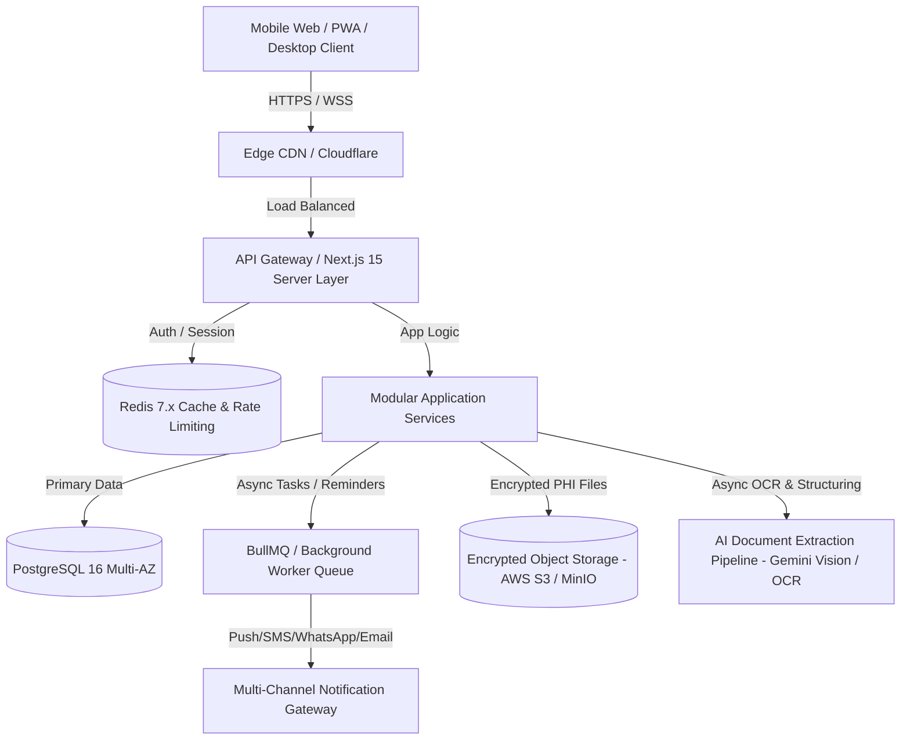
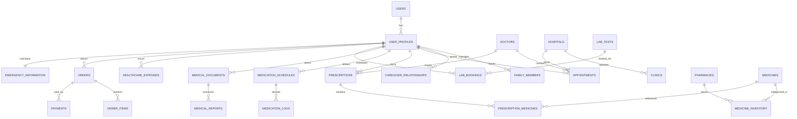
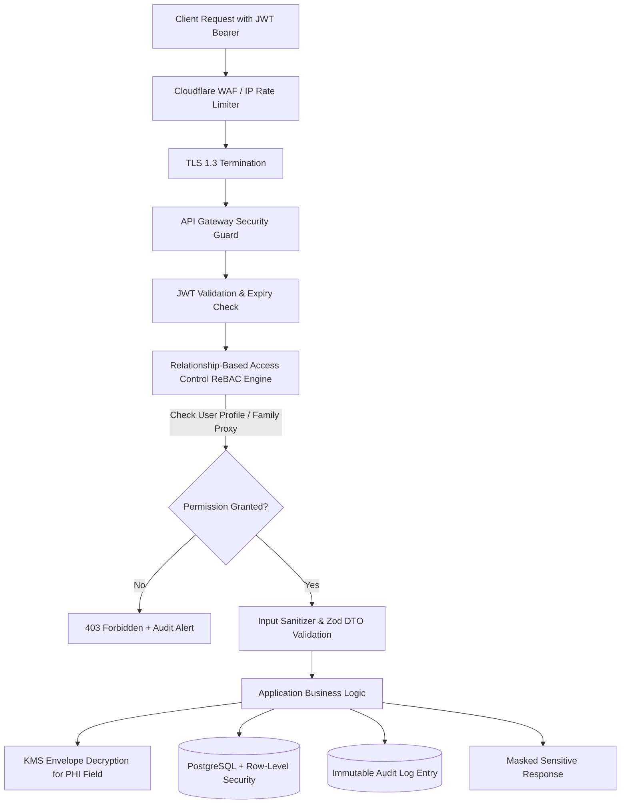
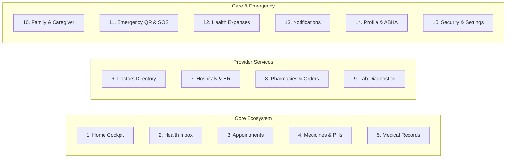
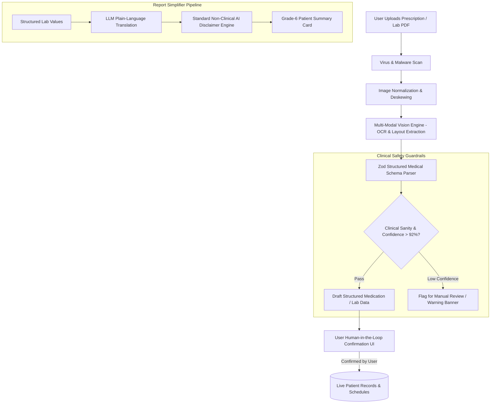
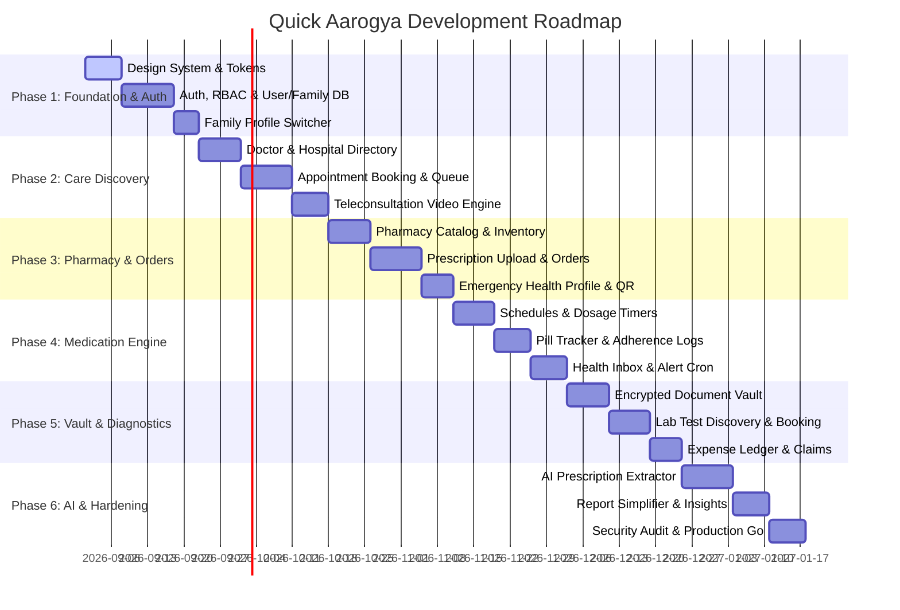

# Technical Architecture & Implementation Plan: Quick Aarogya Healthcare Platform

Quick Aarogya is a unified, production-grade personal and family healthcare management ecosystem designed to orchestrate the entire patient care continuum: doctor/hospital discovery & booking, pharmacy fulfillment & inventory, intelligent medication tracking with adherence reminders, digital health document vault, diagnostic lab test management, family caregiver proxies, emergency medical profiles, and healthcare financial tracking.

---

## 1. Executive Summary & Technology Stack Decision

### 1.1 Existing Codebase & Environment Inspection
* **Workspace Status:** Greenfield project directory (`c:\Users\thesh\Downloads\Quick Aarogya`).
* **Environment Tools:** Node.js `v22.14.0`, npm `10.9.2`, Windows OS.
* **Target Runtime & Stack:** Modern Enterprise TypeScript Full-Stack (Next.js 15 App Router + Node.js Modular Services + PostgreSQL + Redis + Tailwind-free Custom Healthcare Design System).

### 1.2 Recommended Technology Stack



* **Frontend Framework:** Next.js 15 (React 19, TypeScript 5.x) with Server Components (RSC) for instantaneous page loads and Client Components for dynamic healthcare state.
* **Styling & Design System:** Custom Vanilla CSS Design System with CSS Variables and Design Tokens (Zero Tailwind dependency as required; maximum control over WCAG AAA healthcare accessibility, dark/light themes, and smooth micro-interactions).
* **State Management:**
  * **Server State & Caching:** TanStack Query v5 (React Query) with optimistic updates, stale-while-revalidate, and offline persistence.
  * **Client / UI State:** Zustand (lightweight, zero-boilerplate store for active family profile, medication timers, cart, modal stack).
  * **Form Architecture:** React Hook Form + Zod (type-safe validation, multi-step clinical wizards, auto-save drafts).
* **Backend Architecture:** Modular Monolith (Clean Architecture: Controller Layer $\rightarrow$ Service Layer $\rightarrow$ Data Access Layer $\rightarrow$ PostgreSQL) with standard RESTful OpenAPI endpoints and Next.js Server Actions.
* **Database & ORM:** PostgreSQL 16 with Prisma ORM or Drizzle ORM, with connection pooling via PgBouncer.
* **Caching & Job Scheduling:** Redis 7 + BullMQ for real-time medication reminder scheduling, cron-based dosage alerts, inventory expiry checks, and async AI extraction.
* **Storage & Encryption:** S3-compatible object storage with AWS KMS / envelope encryption for PHI (Protected Health Information).

---

## 2. Frontend Architecture & Design System

### 2.1 Application Structure & Routing

```
src/
├── app/                                    # Next.js 15 App Router
│   ├── (auth)/                             # Auth group (Login, Register, OTP, Forgot Password)
│   │   ├── login/page.tsx
│   │   ├── register/page.tsx
│   │   ├── verify-otp/page.tsx
│   │   └── layout.tsx
│   ├── (dashboard)/                        # Authenticated User Experience
│   │   ├── layout.tsx                      # App Shell (Sidebar, TopBar, Mobile BottomNav, Profile Switcher)
│   │   ├── page.tsx                        # Module 1: Home (Unified Health Cockpit)
│   │   ├── inbox/page.tsx                  # Module 2: Health Inbox & Clinical Alerts
│   │   ├── appointments/                   # Module 3: Appointments (List, Book, Teleconsult, Reschedule)
│   │   ├── medicines/                      # Module 4: Medication Tracker, Schedules, Refills
│   │   ├── records/                        # Module 5: Health Vault, Timeline, Reports
│   │   ├── doctors/                        # Module 6: Doctor Discovery & Booking
│   │   ├── hospitals/                      # Module 7: Hospital & ER Directory
│   │   ├── pharmacies/                     # Module 8: Pharmacy & Medicine Orders
│   │   ├── labs/                           # Module 9: Diagnostic Tests & Bookings
│   │   ├── family/                         # Module 10: Family Member Management & Proxy Access
│   │   ├── emergency/                      # Module 11: Emergency Health Profile & Responders QR
│   │   ├── expenses/                       # Module 12: Healthcare Expense & Claims Tracker
│   │   ├── notifications/page.tsx          # Module 13: Notification Center
│   │   ├── profile/page.tsx                # Module 14: User Demographics & ABHA ID
│   │   └── settings/page.tsx               # Module 15: Privacy, Security, Audit Logs
│   ├── (portal)/                           # Specialized Provider Portals
│   │   ├── doctor/                         # Doctor Consultation & E-Prescription Portal
│   │   ├── hospital/                       # Hospital Administration & Queue Portal
│   │   ├── pharmacy/                       # Pharmacy Inventory & Order Dispatch Portal
│   │   ├── lab/                            # Lab Diagnostics & Smart Report Upload Portal
│   │   └── admin/                          # Platform Administration & Compliance Portal
│   ├── emergency/[token]/page.tsx          # Public First-Responder Emergency Access (Read-Only)
│   ├── api/                                # Backend REST Endpoints
│   ├── layout.tsx                          # Root Layout (Theme, Providers, Toast, Font)
│   └── globals.css                         # CSS Variables, Design Tokens, Reset
```

### 2.2 Healthcare Design System ("Aarogya Design System")

The design system prioritizes a **calm, trustworthy, clinically precise, and accessible** aesthetic. It uses custom CSS tokens to eliminate visual noise and anxiety associated with medical situations.

#### 2.2.1 Design Tokens & Color Palette

```css
:root {
  /* Brand & Primary Clinical Colors */
  --color-primary-50: #eef8f8;
  --color-primary-100: #d5f0f0;
  --color-primary-500: #0d8282;  /* Deep Healing Teal - Core Brand */
  --color-primary-600: #0a6969;
  --color-primary-700: #085252;
  --color-primary-900: #042e2e;

  /* Secondary & Accents */
  --color-secondary-50: #f0f5fa;
  --color-secondary-500: #1a56db; /* Serene Medical Blue */
  --color-secondary-700: #1442a6;

  /* Clinical Status Indicators (WCAG AAA High Contrast) */
  --color-success-bg: #ecfdf5;
  --color-success-text: #065f46;
  --color-success-border: #a7f3d0;
  --color-warning-bg: #fffbeb;
  --color-warning-text: #92400e;
  --color-warning-border: #fde68a;
  --color-danger-bg: #fef2f2;
  --color-danger-text: #991b1b;
  --color-danger-border: #fecaca;
  --color-info-bg: #f0f9ff;
  --color-info-text: #075985;
  --color-info-border: #bae6fd;

  /* Emergency High-Visibility Accent */
  --color-emergency: #dc2626;
  --color-emergency-glow: rgba(220, 38, 38, 0.25);

  /* Neutrals & Surfaces */
  --color-surface-bg: #f8fafc;
  --color-surface-card: #ffffff;
  --color-surface-hover: #f1f5f9;
  --color-text-primary: #0f172a;
  --color-text-secondary: #475569;
  --color-text-muted: #94a3b8;
  --color-border: #e2e8f0;
  --color-border-subtle: #f1f5f9;

  /* Typography */
  --font-family-sans: 'Inter', system-ui, -apple-system, BlinkMacSystemFont, 'Segoe UI', Roboto, sans-serif;
  --font-family-display: 'Outfit', var(--font-family-sans);
  --font-family-mono: 'JetBrains Mono', monospace;

  /* Spacing Scale (4px Base Grid) */
  --space-1: 0.25rem;  /* 4px */
  --space-2: 0.5rem;   /* 8px */
  --space-3: 0.75rem;  /* 12px */
  --space-4: 1rem;     /* 16px */
  --space-5: 1.25rem;  /* 20px */
  --space-6: 1.5rem;   /* 24px */
  --space-8: 2rem;     /* 32px */
  --space-12: 3rem;    /* 48px */

  /* Radius */
  --radius-sm: 6px;
  --radius-md: 10px;
  --radius-lg: 16px;
  --radius-xl: 24px;
  --radius-full: 9999px;

  /* Elevation / Shadows */
  --shadow-sm: 0 1px 2px 0 rgba(15, 23, 42, 0.05);
  --shadow-md: 0 4px 6px -1px rgba(15, 23, 42, 0.08), 0 2px 4px -2px rgba(15, 23, 42, 0.05);
  --shadow-lg: 0 10px 15px -3px rgba(15, 23, 42, 0.08), 0 4px 6px -4px rgba(15, 23, 42, 0.03);
  --shadow-float: 0 20px 25px -5px rgba(15, 23, 42, 0.1), 0 8px 10px -6px rgba(15, 23, 42, 0.05);

  /* Transitions */
  --transition-fast: 150ms cubic-bezier(0.4, 0, 0.2, 1);
  --transition-normal: 250ms cubic-bezier(0.4, 0, 0.2, 1);
}
```

#### 2.2.2 Core UI Components & State Feedback

1. **Vital Trend & Health Cards:** Glassmorphic card surfaces with subtle borders, dynamic sparklines, and status badges.
2. **Medication Schedule Pill-Tracker:** Visual dosage timer with one-tap "Mark as Taken", "Snooze 15m", and live inventory countdown meter.
3. **Emergency Action Bar:** High-contrast persistent SOS banner and dynamic QR card with zero friction for emergency workers.
4. **Form Inputs:** Accessible floating labels, inline error messages, clear active states, and mobile numeric keypad optimizations for medical values.
5. **State Feedback:**
   * **Loading:** Pulsing shimmer skeletons mimicking anatomical layouts (no jarring blank pages).
   * **Empty States:** Calming illustrations with direct call-to-actions (e.g., "No active prescriptions. Upload your first prescription or schedule a consultation.").
   * **Error States:** Informative, non-threatening error boundaries with one-click "Retry" and diagnostic codes.

---

## 3. Normalized Database Schema (PostgreSQL DDL & Specifications)

The database schema is normalized to 3NF with strict relational integrity, UUIDv7 primary keys for chronological indexing, foreign key constraints with indexed lookup columns, and JSONB fields for flexible medical metadata.



### 3.1 Entity Schema Specifications (All 27 Entities)

#### 1. `users`
* **Purpose:** Core authentication and account identity.
* **Fields:** `id` (UUID PK), `email` (VARCHAR 255 UNIQUE), `phone_number` (VARCHAR 20 UNIQUE), `password_hash` (VARCHAR 255 NULL for OAuth/OTP), `role` (ENUM: `patient`, `doctor`, `hospital_admin`, `pharmacy_admin`, `lab_admin`, `platform_admin`), `is_phone_verified` (BOOLEAN DEFAULT FALSE), `is_email_verified` (BOOLEAN DEFAULT FALSE), `mfa_enabled` (BOOLEAN DEFAULT FALSE), `mfa_secret` (VARCHAR 255 NULL), `status` (ENUM: `active`, `suspended`, `pending_verification`), `created_at` (TIMESTAMPTZ), `updated_at` (TIMESTAMPTZ).
* **Indexes:** `idx_users_email`, `idx_users_phone`, `idx_users_role`.

#### 2. `user_profiles`
* **Purpose:** Demographic and foundational health identity for the primary account holder.
* **Fields:** `id` (UUID PK), `user_id` (UUID FK $\rightarrow$ `users.id` UNIQUE ON DELETE CASCADE), `first_name` (VARCHAR 100), `last_name` (VARCHAR 100), `date_of_birth` (DATE), `gender` (ENUM: `male`, `female`, `other`, `prefer_not_to_say`), `blood_group` (ENUM: `A+`, `A-`, `B+`, `B-`, `AB+`, `AB-`, `O+`, `O-`, `unknown`), `abha_id` (VARCHAR 50 UNIQUE NULL - National Health ID), `avatar_url` (TEXT NULL), `height_cm` (NUMERIC(5,2) NULL), `weight_kg` (NUMERIC(5,2) NULL), `created_at` (TIMESTAMPTZ), `updated_at` (TIMESTAMPTZ).
* **Indexes:** `idx_user_profiles_user_id`, `idx_user_profiles_abha_id`.

#### 3. `family_members`
* **Purpose:** Dependents and family profiles managed under a master account.
* **Fields:** `id` (UUID PK), `primary_user_profile_id` (UUID FK $\rightarrow$ `user_profiles.id` ON DELETE CASCADE), `linked_user_id` (UUID FK $\rightarrow$ `users.id` NULL for registered adults), `full_name` (VARCHAR 150), `relationship` (ENUM: `spouse`, `child`, `parent`, `sibling`, `grandparent`, `other`), `date_of_birth` (DATE), `gender` (ENUM: `male`, `female`, `other`), `blood_group` (ENUM: `A+`, `A-`, `B+`, `B-`, `AB+`, `AB-`, `O+`, `O-`, `unknown`), `abha_id` (VARCHAR 50 NULL), `avatar_url` (TEXT NULL), `created_at` (TIMESTAMPTZ), `updated_at` (TIMESTAMPTZ).
* **Indexes:** `idx_family_members_primary_user`, `idx_family_members_linked_user`.

#### 4. `caregiver_relationships`
* **Purpose:** Granular proxy and caregiver permissions between users and family profiles.
* **Fields:** `id` (UUID PK), `caregiver_profile_id` (UUID FK $\rightarrow$ `user_profiles.id` ON DELETE CASCADE), `patient_profile_id` (UUID FK $\rightarrow$ `user_profiles.id` ON DELETE CASCADE), `family_member_id` (UUID FK $\rightarrow$ `family_members.id` NULL), `permission_level` (ENUM: `view_only`, `medication_manager`, `appointment_manager`, `full_proxy`, `emergency_only`), `is_active` (BOOLEAN DEFAULT TRUE), `consent_granted_at` (TIMESTAMPTZ), `expires_at` (TIMESTAMPTZ NULL), `created_at` (TIMESTAMPTZ).
* **Constraints:** `UNIQUE(caregiver_profile_id, patient_profile_id, family_member_id)`.
* **Indexes:** `idx_caregiver_lookup`.

#### 5. `doctors`
* **Purpose:** Verified medical doctor profiles and credentials.
* **Fields:** `id` (UUID PK), `user_id` (UUID FK $\rightarrow$ `users.id` ON DELETE RESTRICT), `medical_license_number` (VARCHAR 100 UNIQUE), `specialization` (VARCHAR 150), `sub_specialties` (TEXT[]), `qualification` (VARCHAR 255 - e.g., MBBS, MD, DM), `experience_years` (INT), `consultation_fee` (NUMERIC(10,2)), `followup_fee` (NUMERIC(10,2)), `bio` (TEXT), `rating_average` (NUMERIC(3,2) DEFAULT 5.0), `rating_count` (INT DEFAULT 0), `is_verified` (BOOLEAN DEFAULT FALSE), `created_at` (TIMESTAMPTZ), `updated_at` (TIMESTAMPTZ).
* **Indexes:** `idx_doctors_specialization`, `idx_doctors_user_id`, `idx_doctors_license`.

#### 6. `hospitals`
* **Purpose:** Inpatient/Outpatient hospital and healthcare center profiles.
* **Fields:** `id` (UUID PK), `name` (VARCHAR 255), `registration_number` (VARCHAR 100 UNIQUE), `type` (ENUM: `multispecialty`, `super_specialty`, `general`, `clinic_chain`, `government`), `address_line1` (TEXT), `city` (VARCHAR 100), `state` (VARCHAR 100), `postal_code` (VARCHAR 20), `latitude` (NUMERIC(10,8)), `longitude` (NUMERIC(11,8)), `emergency_helpline` (VARCHAR 30), `has_emergency_service` (BOOLEAN DEFAULT TRUE), `facilities` (JSONB - ICU beds, NICU, trauma center, ambulance count), `is_verified` (BOOLEAN DEFAULT FALSE), `created_at` (TIMESTAMPTZ), `updated_at` (TIMESTAMPTZ).
* **Indexes:** `idx_hospitals_geo` (PostGIS / Lat-Lng), `idx_hospitals_city`.

#### 7. `clinics`
* **Purpose:** Outpatient clinics, departmental rooms, and doctor practice locations.
* **Fields:** `id` (UUID PK), `hospital_id` (UUID FK $\rightarrow$ `hospitals.id` NULL), `name` (VARCHAR 200), `phone` (VARCHAR 30), `address_line1` (TEXT), `city` (VARCHAR 100), `operating_hours` (JSONB - opening/closing per day), `created_at` (TIMESTAMPTZ), `updated_at` (TIMESTAMPTZ).

#### 8. `pharmacies`
* **Purpose:** Licensed retail and hospital pharmacies.
* **Fields:** `id` (UUID PK), `user_id` (UUID FK $\rightarrow$ `users.id` NULL), `name` (VARCHAR 255), `drug_license_number` (VARCHAR 100 UNIQUE), `phone` (VARCHAR 30), `email` (VARCHAR 255), `address_line1` (TEXT), `city` (VARCHAR 100), `postal_code` (VARCHAR 20), `latitude` (NUMERIC(10,8)), `longitude` (NUMERIC(11,8)), `delivery_radius_km` (NUMERIC(5,2) DEFAULT 10.0), `is_24_hours` (BOOLEAN DEFAULT FALSE), `is_verified` (BOOLEAN DEFAULT FALSE), `created_at` (TIMESTAMPTZ), `updated_at` (TIMESTAMPTZ).
* **Indexes:** `idx_pharmacies_geo`, `idx_pharmacies_license`.

#### 9. `medicines`
* **Purpose:** Standardized master pharmacopeia database.
* **Fields:** `id` (UUID PK), `brand_name` (VARCHAR 255), `generic_name` (VARCHAR 255), `dosage_form` (ENUM: `tablet`, `capsule`, `syrup`, `injection`, `ointment`, `inhaler`, `drops`, `powder`), `strength` (VARCHAR 100 - e.g. 500mg, 10mg/5ml), `manufacturer` (VARCHAR 255), `schedule_type` (ENUM: `OTC`, `Schedule_H`, `Schedule_H1`, `Schedule_X`), `prescription_required` (BOOLEAN DEFAULT TRUE), `side_effects` (TEXT[]), `contraindications` (TEXT[]), `created_at` (TIMESTAMPTZ).
* **Indexes:** `idx_medicines_brand_name`, `idx_medicines_generic_name` (Full-Text Search / GIN).

#### 10. `medicine_inventory`
* **Purpose:** Local pharmacy stock, pricing, and batch expiration.
* **Fields:** `id` (UUID PK), `pharmacy_id` (UUID FK $\rightarrow$ `pharmacies.id` ON DELETE CASCADE), `medicine_id` (UUID FK $\rightarrow$ `medicines.id` ON DELETE CASCADE), `batch_number` (VARCHAR 100), `expiry_date` (DATE), `stock_quantity` (INT DEFAULT 0), `mrp` (NUMERIC(10,2)), `selling_price` (NUMERIC(10,2)), `is_available` (BOOLEAN DEFAULT TRUE), `updated_at` (TIMESTAMPTZ).
* **Constraints:** `CHECK (stock_quantity >= 0)`, `CHECK (selling_price <= mrp)`.
* **Indexes:** `idx_inventory_pharmacy_med`, `idx_inventory_expiry`.

#### 11. `prescriptions`
* **Purpose:** Digital and uploaded prescriptions.
* **Fields:** `id` (UUID PK), `prescription_number` (VARCHAR 50 UNIQUE), `patient_profile_id` (UUID FK $\rightarrow$ `user_profiles.id`), `family_member_id` (UUID FK $\rightarrow$ `family_members.id` NULL), `doctor_id` (UUID FK $\rightarrow$ `doctors.id` NULL for external uploads), `external_doctor_name` (VARCHAR 200 NULL), `issue_date` (DATE), `valid_until` (DATE), `diagnosis` (TEXT), `file_url` (TEXT NULL), `digital_signature_hash` (TEXT NULL), `status` (ENUM: `active`, `completed`, `expired`, `cancelled`), `created_at` (TIMESTAMPTZ), `updated_at` (TIMESTAMPTZ).
* **Indexes:** `idx_prescriptions_patient`, `idx_prescriptions_doctor`.

#### 12. `prescription_medicines`
* **Purpose:** Individual line items and medication directions on a prescription.
* **Fields:** `id` (UUID PK), `prescription_id` (UUID FK $\rightarrow$ `prescriptions.id` ON DELETE CASCADE), `medicine_id` (UUID FK $\rightarrow$ `medicines.id` NULL), `custom_medicine_name` (VARCHAR 255 NULL), `dosage` (VARCHAR 50 - e.g., "1 tablet"), `frequency` (VARCHAR 50 - e.g., "1-0-1", "Every 8 hours"), `timing` (ENUM: `before_food`, `after_food`, `with_food`, `empty_stomach`, `bedtime`), `duration_days` (INT), `total_quantity` (INT), `instructions` (TEXT), `created_at` (TIMESTAMPTZ).
* **Indexes:** `idx_presc_med_prescription_id`.

#### 13. `medication_schedules`
* **Purpose:** Active medication schedules, pill countdowns, and adherence tracking.
* **Fields:** `id` (UUID PK), `user_profile_id` (UUID FK $\rightarrow$ `user_profiles.id`), `family_member_id` (UUID FK $\rightarrow$ `family_members.id` NULL), `medicine_id` (UUID FK $\rightarrow$ `medicines.id` NULL), `custom_medicine_name` (VARCHAR 255), `dosage_amount` (VARCHAR 50), `dose_unit` (VARCHAR 30), `schedule_times` (TIME[] - e.g. `['08:00:00', '20:00:00']`), `start_date` (DATE), `end_date` (DATE NULL for chronic meds), `initial_quantity` (INT), `remaining_quantity` (INT), `refill_threshold` (INT DEFAULT 5), `is_refill_reminder_active` (BOOLEAN DEFAULT TRUE), `is_active` (BOOLEAN DEFAULT TRUE), `instructions` (TEXT), `created_at` (TIMESTAMPTZ), `updated_at` (TIMESTAMPTZ).
* **Indexes:** `idx_med_sched_user`, `idx_med_sched_active`.

#### 14. `medication_logs`
* **Purpose:** Immutable adherence records for every scheduled dose.
* **Fields:** `id` (UUID PK), `medication_schedule_id` (UUID FK $\rightarrow$ `medication_schedules.id` ON DELETE CASCADE), `scheduled_time` (TIMESTAMPTZ), `action_taken_time` (TIMESTAMPTZ NULL), `status` (ENUM: `pending`, `taken`, `skipped`, `snoozed`, `missed`), `recorded_by_user_id` (UUID FK $\rightarrow$ `users.id`), `notes` (TEXT NULL), `created_at` (TIMESTAMPTZ).
* **Indexes:** `idx_med_logs_sched_time`, `idx_med_logs_status`.

#### 15. `appointments`
* **Purpose:** In-person and teleconsultation bookings.
* **Fields:** `id` (UUID PK), `appointment_number` (VARCHAR 50 UNIQUE), `doctor_id` (UUID FK $\rightarrow$ `doctors.id`), `patient_profile_id` (UUID FK $\rightarrow$ `user_profiles.id`), `family_member_id` (UUID FK $\rightarrow$ `family_members.id` NULL), `hospital_id` (UUID FK $\rightarrow$ `hospitals.id` NULL), `clinic_id` (UUID FK $\rightarrow$ `clinics.id` NULL), `appointment_datetime` (TIMESTAMPTZ), `type` (ENUM: `in_person`, `video_teleconsult`, `follow_up`), `status` (ENUM: `booked`, `confirmed`, `checked_in`, `in_consultation`, `completed`, `cancelled`, `no_show`), `token_number` (INT NULL), `symptoms` (TEXT), `consultation_notes` (TEXT NULL), `meeting_room_id` (VARCHAR 100 NULL), `cancelled_reason` (TEXT NULL), `created_at` (TIMESTAMPTZ), `updated_at` (TIMESTAMPTZ).
* **Indexes:** `idx_appts_doctor_datetime`, `idx_appts_patient_datetime`.

#### 16. `medical_documents`
* **Purpose:** Encrypted document vault for PDFs, imaging scans, and discharge summaries.
* **Fields:** `id` (UUID PK), `user_profile_id` (UUID FK $\rightarrow$ `user_profiles.id`), `family_member_id` (UUID FK $\rightarrow$ `family_members.id` NULL), `category` (ENUM: `prescription`, `lab_report`, `discharge_summary`, `radiology_scan`, `vaccination_record`, `insurance_policy`, `invoice`, `other`), `title` (VARCHAR 255), `document_date` (DATE), `file_url` (TEXT), `file_size_bytes` (BIGINT), `mime_type` (VARCHAR 100), `file_hash_sha256` (VARCHAR 64), `is_encrypted` (BOOLEAN DEFAULT TRUE), `encryption_key_id` (VARCHAR 100), `tags` (TEXT[]), `ai_extracted_text` (TEXT NULL), `ai_classification_status` (ENUM: `unprocessed`, `processing`, `completed`, `failed`), `created_at` (TIMESTAMPTZ), `updated_at` (TIMESTAMPTZ).
* **Indexes:** `idx_docs_patient_category`, `idx_docs_date`.

#### 17. `medical_reports`
* **Purpose:** Parsed, structured biomarker and diagnostic test values.
* **Fields:** `id` (UUID PK), `medical_document_id` (UUID FK $\rightarrow$ `medical_documents.id` ON DELETE CASCADE), `test_name` (VARCHAR 200), `biomarker` (VARCHAR 150 - e.g. "HbA1c", "Serum Creatinine"), `measured_value` (VARCHAR 50), `numeric_value` (NUMERIC(10,4) NULL), `unit` (VARCHAR 50 - e.g. "mg/dL", "%"), `reference_range_min` (NUMERIC(10,4) NULL), `reference_range_max` (NUMERIC(10,4) NULL), `reference_text` (VARCHAR 100 NULL), `is_abnormal` (BOOLEAN DEFAULT FALSE), `flag` (ENUM: `normal`, `low`, `high`, `critical`), `doctor_interpretation` (TEXT NULL), `created_at` (TIMESTAMPTZ).
* **Indexes:** `idx_med_reports_biomarker`, `idx_med_reports_doc_id`.

#### 18. `lab_tests`
* **Purpose:** Master catalog of diagnostic tests and health checkup packages.
* **Fields:** `id` (UUID PK), `name` (VARCHAR 255), `code` (VARCHAR 50 UNIQUE), `category` (ENUM: `biochemistry`, `hematology`, `pathology`, `radiology`, `microbiology`, `genetic`), `sample_type` (VARCHAR 100 - e.g. Blood, Urine, Saliva), `fasting_required_hours` (INT DEFAULT 0), `turnaround_time_hours` (INT), `base_price` (NUMERIC(10,2)), `description` (TEXT), `preparation_instructions` (TEXT), `created_at` (TIMESTAMPTZ).
* **Indexes:** `idx_lab_tests_name`, `idx_lab_tests_category`.

#### 19. `lab_bookings`
* **Purpose:** Diagnostic appointment bookings and sample collection tracking.
* **Fields:** `id` (UUID PK), `booking_number` (VARCHAR 50 UNIQUE), `user_profile_id` (UUID FK $\rightarrow$ `user_profiles.id`), `family_member_id` (UUID FK $\rightarrow$ `family_members.id` NULL), `lab_admin_user_id` (UUID FK $\rightarrow$ `users.id` NULL), `collection_type` (ENUM: `home_collection`, `walk_in_lab`), `collection_address_id` (UUID FK $\rightarrow$ `addresses.id` NULL), `scheduled_datetime` (TIMESTAMPTZ), `status` (ENUM: `requested`, `sample_collector_assigned`, `sample_collected`, `processing_in_lab`, `report_ready`, `completed`, `cancelled`), `phlebotomist_name` (VARCHAR 100 NULL), `phlebotomist_phone` (VARCHAR 30 NULL), `report_document_id` (UUID FK $\rightarrow$ `medical_documents.id` NULL), `created_at` (TIMESTAMPTZ), `updated_at` (TIMESTAMPTZ).
* **Indexes:** `idx_lab_bookings_user`, `idx_lab_bookings_status`.

#### 20. `notifications`
* **Purpose:** Multi-channel dispatched alerts and health notifications.
* **Fields:** `id` (UUID PK), `user_id` (UUID FK $\rightarrow$ `users.id` ON DELETE CASCADE), `channel` (ENUM: `in_app`, `push`, `sms`, `whatsapp`, `email`), `category` (ENUM: `medication_reminder`, `refill_alert`, `appointment_update`, `lab_report_ready`, `emergency_sos`, `expense_receipt`, `system`), `title` (VARCHAR 255), `body` (TEXT), `action_url` (TEXT NULL), `payload` (JSONB NULL), `is_read` (BOOLEAN DEFAULT FALSE), `sent_at` (TIMESTAMPTZ DEFAULT NOW()), `read_at` (TIMESTAMPTZ NULL).
* **Indexes:** `idx_notifications_user_read`, `idx_notifications_sent_at`.

#### 21. `emergency_information`
* **Purpose:** Critical life-saving profile accessible via secure QR code.
* **Fields:** `id` (UUID PK), `user_profile_id` (UUID FK $\rightarrow$ `user_profiles.id` UNIQUE ON DELETE CASCADE), `blood_group` (VARCHAR 10), `allergies` (TEXT[]), `chronic_conditions` (TEXT[]), `current_medications_summary` (TEXT[]), `implanted_devices` (TEXT[] - e.g. Pacemaker, Stent), `organ_donor` (BOOLEAN DEFAULT FALSE), `emergency_contacts` (JSONB - Array of objects with name, relation, phone, priority), `public_emergency_token` (VARCHAR 64 UNIQUE), `is_emergency_profile_public` (BOOLEAN DEFAULT TRUE), `requires_pin_to_view_full` (BOOLEAN DEFAULT FALSE), `emergency_pin_hash` (VARCHAR 255 NULL), `updated_at` (TIMESTAMPTZ).
* **Indexes:** `idx_emergency_token`, `idx_emergency_profile_user`.

#### 22. `healthcare_expenses`
* **Purpose:** Healthcare financial ledger, insurance claims, and tax deductors.
* **Fields:** `id` (UUID PK), `user_profile_id` (UUID FK $\rightarrow$ `user_profiles.id`), `family_member_id` (UUID FK $\rightarrow$ `family_members.id` NULL), `category` (ENUM: `doctor_consultation`, `medicines`, `lab_diagnostics`, `hospitalization`, `health_insurance_premium`, `medical_devices`, `therapy`), `title` (VARCHAR 255), `amount` (NUMERIC(10,2)), `currency` (VARCHAR(3) DEFAULT 'INR'), `expense_date` (DATE), `payment_method` (ENUM: `cash`, `upi`, `credit_card`, `debit_card`, `net_banking`, `insurance_tpa`), `receipt_document_id` (UUID FK $\rightarrow$ `medical_documents.id` NULL), `is_insurance_claimable` (BOOLEAN DEFAULT FALSE), `claim_status` (ENUM: `not_claimed`, `submitted`, `in_review`, `approved`, `rejected`, `reimbursed`), `claim_amount_reimbursed` (NUMERIC(10,2) DEFAULT 0), `notes` (TEXT NULL), `created_at` (TIMESTAMPTZ), `updated_at` (TIMESTAMPTZ).
* **Indexes:** `idx_expenses_user_date`, `idx_expenses_category`.

#### 23. `orders`
* **Purpose:** Pharmacy medicine deliveries and diagnostic kit purchases.
* **Fields:** `id` (UUID PK), `order_number` (VARCHAR 50 UNIQUE), `user_profile_id` (UUID FK $\rightarrow$ `user_profiles.id`), `pharmacy_id` (UUID FK $\rightarrow$ `pharmacies.id` NULL), `delivery_address_id` (UUID FK $\rightarrow$ `addresses.id`), `prescription_id` (UUID FK $\rightarrow$ `prescriptions.id` NULL), `subtotal_amount` (NUMERIC(10,2)), `discount_amount` (NUMERIC(10,2) DEFAULT 0), `delivery_fee` (NUMERIC(10,2) DEFAULT 0), `tax_amount` (NUMERIC(10,2) DEFAULT 0), `total_amount` (NUMERIC(10,2)), `status` (ENUM: `placed`, `prescription_verified`, `preparing`, `dispatched`, `out_for_delivery`, `delivered`, `cancelled`, `refunded`), `delivery_partner_name` (VARCHAR 100 NULL), `tracking_number` (VARCHAR 100 NULL), `created_at` (TIMESTAMPTZ), `updated_at` (TIMESTAMPTZ).
* **Indexes:** `idx_orders_user`, `idx_orders_pharmacy`, `idx_orders_status`.

#### 24. `order_items`
* **Purpose:** Line items within a pharmacy order.
* **Fields:** `id` (UUID PK), `order_id` (UUID FK $\rightarrow$ `orders.id` ON DELETE CASCADE), `medicine_id` (UUID FK $\rightarrow$ `medicines.id`), `quantity` (INT), `unit_price` (NUMERIC(10,2)), `total_price` (NUMERIC(10,2)), `created_at` (TIMESTAMPTZ).
* **Indexes:** `idx_order_items_order_id`.

#### 25. `payments`
* **Purpose:** Financial payment transactions and gateway settlements.
* **Fields:** `id` (UUID PK), `payment_reference` (VARCHAR 100 UNIQUE), `order_id` (UUID FK $\rightarrow$ `orders.id` NULL), `appointment_id` (UUID FK $\rightarrow$ `appointments.id` NULL), `lab_booking_id` (UUID FK $\rightarrow$ `lab_bookings.id` NULL), `gateway` (ENUM: `razorpay`, `stripe`, `phonepe`, `cash_on_delivery`), `gateway_transaction_id` (VARCHAR 255 NULL), `amount` (NUMERIC(10,2)), `currency` (VARCHAR(3) DEFAULT 'INR'), `status` (ENUM: `initiated`, `authorized`, `captured`, `failed`, `refunded`), `payment_method_type` (VARCHAR 50 - e.g. UPI, Card, NetBanking), `paid_at` (TIMESTAMPTZ NULL), `created_at` (TIMESTAMPTZ).
* **Indexes:** `idx_payments_ref`, `idx_payments_status`.

#### 26. `addresses`
* **Purpose:** Geocoded residential and delivery addresses for patients.
* **Fields:** `id` (UUID PK), `user_profile_id` (UUID FK $\rightarrow$ `user_profiles.id` ON DELETE CASCADE), `label` (VARCHAR 50 - e.g. "Home", "Parents' Place", "Office"), `recipient_name` (VARCHAR 150), `phone_number` (VARCHAR 30), `address_line1` (TEXT), `address_line2` (TEXT NULL), `landmark` (VARCHAR 255 NULL), `city` (VARCHAR 100), `state` (VARCHAR 100), `postal_code` (VARCHAR 20), `latitude` (NUMERIC(10,8) NULL), `longitude` (NUMERIC(11,8) NULL), `is_default` (BOOLEAN DEFAULT FALSE), `created_at` (TIMESTAMPTZ), `updated_at` (TIMESTAMPTZ).
* **Indexes:** `idx_addresses_user`.

#### 27. `audit_logs`
* **Purpose:** Immutable, tamper-evident HIPAA/DISHA compliance access and change log.
* **Fields:** `id` (UUID PK), `actor_user_id` (UUID FK $\rightarrow$ `users.id` NULL for anonymous emergency access), `actor_role` (VARCHAR 50), `action` (ENUM: `READ_PHI`, `WRITE_PRESCRIPTION`, `MODIFY_MEDICATION`, `VIEW_EMERGENCY_QR`, `EXPORT_HEALTH_DATA`, `AUTH_LOGIN`, `AUTH_FAILED`), `resource_type` (VARCHAR 50 - e.g. `medical_documents`, `prescriptions`), `resource_id` (VARCHAR 100), `ip_address` (VARCHAR 45), `user_agent` (TEXT), `details` (JSONB NULL - old/new values, access purpose), `timestamp` (TIMESTAMPTZ DEFAULT NOW()).
* **Indexes:** `idx_audit_actor_time`, `idx_audit_resource`.

---

## 4. Security, Zero-Trust Architecture & PHI Protection

Healthcare systems demand defense-in-depth where every single access to Protected Health Information (PHI) is authenticated, authorized, encrypted, and immutably audited.



### 4.1 Authentication & Session Management
* **Dual-Token Rotation:** Access Token (15-minute lifetime, stored in memory or short-lived Secure HttpOnly Cookie) + Refresh Token (7-day lifetime, strictly stored in `HttpOnly`, `SameSite=Strict`, `Secure` cookie with database token family tracking for instant revocation upon reuse detection).
* **Multi-Factor Authentication (MFA):** TOTP (RFC 6238) and SMS/WhatsApp OTP required for sensitive clinical actions (e.g., viewing unmasked genomic/HIV records, changing proxy permissions, granting third-party doctor access).
* **Biometric Lock (PWA/Mobile):** WebAuthn / FaceID unlock for local session unlock before rendering health timelines.

### 4.2 Caregiver & Family Proxy ReBAC (Relationship-Based Access Control)
* Authorization is evaluated at runtime:
  $$\text{CanAccess}(Actor, Patient, Resource, Action) = (Actor == Patient) \lor \text{HasValidCaregiverGrant}(Actor, Patient, PermissionLevel) \lor \text{IsAttendingDoctor}(Actor, Patient)$$
* Family members can have granular permission levels:
  * `VIEW_ONLY`: Read past prescriptions, upcoming appointments (no write or order actions).
  * `MEDICATION_MANAGER`: Mark doses as taken/skipped, log vitals, trigger medicine reorders.
  * `FULL_PROXY`: Book appointments, upload records, manage insurance claims on behalf of elderly parents/children.
  * `EMERGENCY_ONLY`: Only unlocked if the emergency SOS flag is active.

### 4.3 Encryption at Rest & In Transit
* **Transit:** TLS 1.3 only with strict HSTS (`max-age=63072000; includeSubDomains; preload`).
* **Database Field-Level Encryption:** Sensitive identifiers (e.g., ABHA ID, Emergency PIN hash, Diagnostic notes) encrypted using AES-256-GCM envelope encryption with AWS KMS / HashiCorp Vault.
* **Document Vault Storage:** Medical document files (PDFs, MRI scans) stored with client-side/pre-signed S3 encryption (`SSE-KMS`). Access is granted strictly via short-lived pre-signed URLs (maximum 5-minute expiry).

### 4.4 Rate Limiting & Protection
* Redis token bucket rate limiting:
  * Global API: 120 req/min per IP.
  * Auth & OTP endpoints: 5 attempts per 10 minutes per IP/Phone.
  * Emergency QR Endpoint: 30 requests per minute with bot protection.

---

## 5. Role-Based & Caregiver Permission Matrix

| Functional Module | Patient / Primary | Family Caregiver | Doctor | Hospital Admin | Pharmacy Admin | Lab Admin | Platform Admin |
| :--- | :---: | :---: | :---: | :---: | :---: | :---: | :---: |
| **Home Cockpit** | Full | Dependent View | Doctor Hub | Hospital Hub | Pharmacy Hub | Lab Hub | Platform Hub |
| **Health Inbox** | Full | Dependent View | Clinical Alerts | System Notices | Order Alerts | Lab Alerts | System Notices |
| **Doctor / Appts** | Book / Reschedule | Book for Dep. | Manage Queue | Manage Doctors | No Access | No Access | View All |
| **Medicines / Schedules**| Full Control | Log / Refill | Prescribe | Hospital Meds | Fulfill / Stock | No Access | Read Schema |
| **Medical Vault / Docs** | Full Vault | Permitted View | Clinical View | Facility Docs | Prescriptions | Upload Reports| Compliance View|
| **Pharmacies / Orders** | Place Orders | Order for Dep. | Verify Rx | OPD Pharmacy | Fulfill & Ship | No Access | Audit Orders |
| **Lab Diagnostics** | Book Tests | Book for Dep. | Order Tests | Pathology Queue| No Access | Upload & Verify| Catalog Mgmt |
| **Family Management** | Full Control | Granted Perms | No Access | No Access | No Access | No Access | Support View |
| **Emergency Profile** | Full Edit | Read / Edit | Emergency Access| Emergency ER | No Access | No Access | Support View |
| **Expenses & Claims** | Full Ledger | View Dep. Exp. | No Access | Billing Module | Invoice Export | Invoice Export | Financial Audit|

---

## 6. Detailed 15-Module Product Architecture



### Module 1: Home (Unified Health Cockpit)
* **Today's Regimen Strip:** Next upcoming dose timer, one-tap "Take Dose", remaining doses for the day.
* **Upcoming Appointments Card:** Active doctor appointment with token queue indicator or "Join Teleconsult" button.
* **Family Quick-Switcher:** Floating carousel to switch context instantly between Self, Mother, Father, Child.
* **Vitals & Health Metric Summary:** Quick glance at latest blood pressure, glucose, and weight readings with trends.
* **Action Shortcuts:** Quick Upload Prescription, Find ER, Emergency Card, Order Medicine Refill.

### Module 2: Health Inbox & Clinical Alerts
* Unified chronological feed for critical medical communication:
  * Lab test results ready with abnormal flag badges.
  * Prescription expiration & refill warnings.
  * Doctor follow-up messages and teleconsult links.
  * Vaccine schedule reminders for children/elderly.

### Module 3: Appointments
* **Provider Search:** Filter by doctor specialty, symptoms (e.g. "chest pain" $\rightarrow$ Cardiologist), hospital affiliation, fee, language, availability.
* **Slot Booking:** Real-time slot reservation with calendar integration.
* **Live Token Tracker:** In-clinic queue tracker showing "5 patients ahead of you" to eliminate crowded waiting rooms.
* **Teleconsultation Room:** WebRTC audio/video integration with end-to-end encrypted chat and in-call prescription drafting for doctors.

### Module 4: Medicines & Adherence Tracker
* **Active Regimen View:** Grouped by morning, afternoon, evening, bedtime.
* **Pill Countdown & Refill Predictor:** "5 days remaining" $\rightarrow$ One-click "Refill via Nearby Pharmacy".
* **Dosage Reminders:** High-priority sound/push alarms with customizable snooze intervals.
* **Adherence Scorecard:** Monthly adherence percentage graphs to share with physicians.

### Module 5: Medical Records & Health Vault
* **Categorized Health Vault:** Filter by Prescriptions, Lab Reports, Discharge Summaries, Radiology (X-Ray/MRI), Invoices.
* **Interactive Biomarker Trend Analyzer:** Graph HbA1c, Cholesterol, and Hemoglobin levels over time across multiple diagnostic reports.
* **Smart Tags & OCR Search:** Instantly find documents by searching medicine names, doctor names, or hospital keywords.
* **Secure Sharing:** Generate a time-limited 6-digit access code for consulting doctors.

### Module 6: Doctors Directory & Portals
* Verified directory with doctor credentials, clinic locations, consult fees, and verified patient reviews.
* **Doctor Portal:** Clinical dashboard for practicing doctors to review patient history with consent, write digital e-prescriptions with automatic drug-interaction warnings, and sign records digitally.

### Module 7: Hospitals & ER Directory
* Comprehensive directory of general and multi-specialty hospitals with facility filters (24/7 ER, ICU, Dialysis, Trauma Center).
* Live emergency helpline dialer and turn-by-turn navigation routing.

### Module 8: Pharmacies & Prescription Fulfillment
* Hyperlocal pharmacy search based on GPS coordinates.
* **Prescription Upload & Quote:** User uploads prescription $\rightarrow$ Nearby pharmacies verify stock and submit quotes $\rightarrow$ User selects best price/delivery time $\rightarrow$ Dispatched.

### Module 9: Lab Tests & Smart Reports
* Search catalog for individual tests (e.g., CBC, Lipid Profile, Thyroid panel) or full-body checkup packages.
* Book home sample collection with phlebotomist location tracking.
* Delivery of verified, interactive digital reports.

### Module 10: Family & Caregiver Hub
* Create dependent profiles for children, aging parents, or spouse.
* Caregiver delegation matrix: assign adult siblings specific roles (e.g., daughter manages mother's medications, son handles hospital appointments).

### Module 11: Emergency Health Profile & Responders QR
* **Emergency Lockscreen Card:** Blood group, critical allergies (e.g., Penicillin allergy), chronic conditions (e.g., Type 1 Diabetes), and next-of-kin emergency phone numbers.
* **Public Emergency QR:** First responders can scan the QR code to instantly access life-saving triage info without needing login, while protecting deep historical records behind an optional PIN.

### Module 12: Healthcare Expenses & Insurance
* Financial ledger of all medical out-of-pocket expenses.
* Category breakdown (Medicines, Consultations, Diagnostics, Hospitalization).
* Insurance claim documentation packager (combines discharge summary, bills, and prescriptions into a single claim PDF).

### Module 13: Notification Center
* Multi-channel orchestration: In-app toasts, Web Push, SMS, WhatsApp Business API, and automated voice reminder options for critical elderly medication alerts.

### Module 14: Profile & ABHA Identity
* Personal demographics, emergency contacts, biometric auth settings, and Ayushman Bharat Health Account (ABHA) integration.

### Module 15: Settings, Privacy & Audit Trail
* Full patient consent dashboard: view which doctors/hospitals have active access to records and revoke access with one tap.
* Comprehensive audit trail: inspect every view and download of health records.

---

## 7. Future AI Architecture & Clinical Guardrails



### 7.1 Strict Clinical AI Principles & Guardrails
1. **AI is NEVER a Doctor:** AI outputs are strictly assistive, non-diagnostic, and clearly labeled with prominent clinical disclaimers.
2. **Human-in-the-Loop (HITL) Verification:** No medication schedule or prescription is ever committed to the active database automatically from an AI scan without explicit user verification and confirmation on a review screen.
3. **Structured JSON Enforcement:** LLM / Vision calls must strictly return data conforming to predefined Zod schemas; malformed or unverified outputs are rejected immediately.
4. **Data Isolation & Privacy:** PHI is stripped of direct patient identifiers before processing by extraction models, and zero customer health data is retained for model training.

### 7.2 Core AI Pipelines
* **Pipeline 1 (Prescription Extraction):** Extracts Medicine Name, Dosage, Frequency (1-0-1), Timing (After Food), Duration, and Doctor registration from handwritten/printed prescriptions.
* **Pipeline 2 (Lab Report Simplifier):** Translates complex medical terms (e.g. "Hypertriglyceridemia") into clear, calm explanations with interactive reference range sliders.
* **Pipeline 3 (Refill & Adherence Intelligence):** Predicts when chronic medicines will run low based on adherence logs and schedules automatic reminder alerts.

---

## 8. Development Strategy, Phases & Implementation Roadmap

To ensure high software quality, maintainability, and zero regressions, the platform is structured into **6 independently buildable, testable phases**:



### Phase 1: Core Foundation, Design System, Auth & Family Profiles
* **Scope:** Setup Next.js 15, Prisma/Drizzle PostgreSQL schema for Users, Profiles, Family Members, Caregiver relationships. Implement "Aarogya Design System" CSS tokens and base components. Build JWT/Refresh auth flow and Family Profile Context Switcher.
* **Acceptance Criteria:** User can register, verify OTP, log in, create 3 family profiles (e.g. Mother, Son), and switch active profiles seamlessly.
* **Tests:** Unit tests for Auth JWT rotation, Zod schemas, Profile state store; Component tests for Base UI.

### Phase 2: Doctor & Hospital Discovery, Appointments & Teleconsult
* **Scope:** Database schema for Doctors, Hospitals, Clinics, Appointments. Search & filter UI for doctors/hospitals. Slot booking, token queue tracking, and WebRTC teleconsultation placeholder/engine.
* **Acceptance Criteria:** User can search doctors by specialty, book a time slot for any selected family member, view appointment status, and cancel/reschedule.
* **Tests:** Integration tests for appointment booking concurrency, double-booking prevention locks, and token generation.

### Phase 3: Pharmacy, Inventory, Order Fulfillment & Emergency Profile
* **Scope:** Database schema for Pharmacies, Medicines, Inventory, Orders, Payments, Addresses, Emergency Information. Hyperlocal pharmacy locator, order checkout with Razorpay/Mock gateway, and Public Emergency QR profile generator.
* **Acceptance Criteria:** User can browse medicines, place a delivery order, enter shipping address, complete payment, and generate a printable/scannable Emergency Health Card.
* **Tests:** Inventory subtraction transactions, order state transitions, Emergency QR token security checks.

### Phase 4: Medication Schedules, Reminders, Adherence & Health Inbox
* **Scope:** Database schema for Medication Schedules, Medication Logs, Notifications. Visual Pill Tracker, Dosage Timers, Remaining Quantity countdown, 1-click refill triggers, and BullMQ background reminder workers.
* **Acceptance Criteria:** User can create a daily medication regimen, receive simulated reminders, mark doses as taken/skipped, and observe the remaining pill count decrement accurately.
* **Tests:** Adherence calculation math tests, Cron schedule trigger tests, reminder notification dispatch tests.

### Phase 5: Health Vault, Lab Diagnostics & Healthcare Expenses
* **Scope:** Database schema for Medical Documents, Medical Reports, Lab Tests, Lab Bookings, Healthcare Expenses. Encrypted document upload/viewer, Biomarker trend graphs, Lab home sample booking, and financial expense ledger with receipt attachments.
* **Acceptance Criteria:** User can upload a blood test PDF, manually add or view biomarker records (HbA1c trend over time), book a lab test, and track total healthcare spending by category.
* **Tests:** S3 pre-signed upload mock tests, file MIME validation, expense aggregation math tests.

### Phase 6: AI Extraction Engine, Smart Insights & Production Hardening
* **Scope:** Multi-modal prescription OCR and structured JSON extraction pipeline, plain-language medical report simplifier, end-to-end audit logging, OWASP security audit, and Dockerized production deployment pipeline.
* **Acceptance Criteria:** Uploading a prescription image generates a structured review modal with extracted dosage/medicines; AI disclaimers are present; full audit log records every action.
* **Tests:** E2E Playwright tests covering critical paths, security DAST scan, load testing with k6.

---

## 9. Monorepo Folder Structure Specification

```
Quick-Aarogya/
├── .github/
│   └── workflows/                          # CI/CD pipelines (Lint, Test, Docker Build, Deploy)
├── prisma/
│   ├── schema.prisma                       # Complete 27-entity Prisma Schema
│   └── migrations/                         # SQL version-controlled migrations
├── public/
│   ├── icons/                              # Healthcare SVG icons & PWA manifests
│   ├── illustrations/                      # Custom medical empty-state SVGs
│   └── favicon.ico
├── src/
│   ├── app/                                # Next.js 15 App Router (15 modules + Provider Portals)
│   ├── components/
│   │   ├── ui/                             # Base Design System Components (Button, Input, Card, Modal, Badge, Skeleton)
│   │   ├── clinical/                       # Medical UI (VitalCard, PillTimer, DoseLog, QRCard, TokenQueue)
│   │   ├── layout/                         # Header, Sidebar, BottomNav, ProfileSwitcher, SOSBanner
│   │   └── modules/                        # Module-specific complex views (Appointments, Meds, Vault, Labs)
│   ├── lib/
│   │   ├── auth/                           # JWT, Password Hashing, Session Guards, OTP
│   │   ├── db/                             # Prisma Client Instance & Connection Pool
│   │   ├── security/                       # Field Encryption, KMS Helpers, Rate Limiter, Audit Logger
│   │   ├── ai/                             # Gemini Vision Client, OCR Parsers, Safety Guardrails
│   │   ├── storage/                        # S3 Client & Pre-signed URL Generators
│   │   └── utils/                          # Date formatters, Clinical unit converters, Validators
│   ├── stores/                             # Zustand Client State Stores
│   │   ├── useFamilyProfileStore.ts        # Active Family Member Context
│   │   ├── useMedicationStore.ts           # Pill timers & active alerts
│   │   └── useCartStore.ts                 # Pharmacy & Lab booking cart
│   ├── types/                              # Strict TypeScript Definitions & DTOs
│   └── styles/
│       ├── tokens.css                      # Design Tokens, Color Palette, Typography, Spacing
│       └── globals.css                     # Global Reset & Utility Classes
├── docker-compose.yml                      # Local Dev Stack (PostgreSQL 16, Redis 7, MinIO S3)
├── Dockerfile                              # Multi-stage production container build
├── package.json
├── tsconfig.json
└── README.md
```

---

## 10. Testing, Quality Assurance & Deployment Strategy

### 10.1 Testing Pyramid
1. **Unit Tests (Vitest / Jest):**
   * Clinical calculations (BMI, dosage intervals, inventory decrement, prescription expiry).
   * Zod DTO schema validation for all API inputs.
   * Authorization policy checks (RBAC & Caregiver ReBAC).
2. **Integration Tests (Supertest / Next.js Test Handlers):**
   * Database transactional integrity (Booking slot concurrency, stock deduction, payment webhook verification).
   * Auth token lifecycle (Login, Refresh rotation, Expired token rejection).
3. **End-to-End Tests (Playwright):**
   * Complete Patient Workflow: Register $\rightarrow$ Add Family Member $\rightarrow$ Book Doctor Appointment $\rightarrow$ Add Medication Schedule $\rightarrow$ Log Dose $\rightarrow$ Upload Prescription $\rightarrow$ View Emergency QR.
4. **Security & Load Tests:**
   * OWASP ZAP automated vulnerability scanning.
   * k6 load testing: 5,000 simulated concurrent users querying doctor slots and medication reminders.

### 10.2 Production Infrastructure & CI/CD Pipeline
* **Continuous Integration:** GitHub Actions executes Linting $\rightarrow$ Typecheck $\rightarrow$ Vitest Unit Tests $\rightarrow$ Playwright E2E Tests on every pull request.
* **Containerization:** Multi-stage `Dockerfile` creating a lightweight, non-root Node.js Alpine production container image.
* **Deployment Target:** High-availability container cluster (Kubernetes or AWS ECS / Cloud Run) behind Cloudflare WAF, backed by AWS RDS PostgreSQL (Multi-AZ) and AWS ElastiCache Redis.
* **Disaster Recovery & Backup:** Automated point-in-time database recovery (PITR) with continuous WAL archiving and daily encrypted S3 backups.
